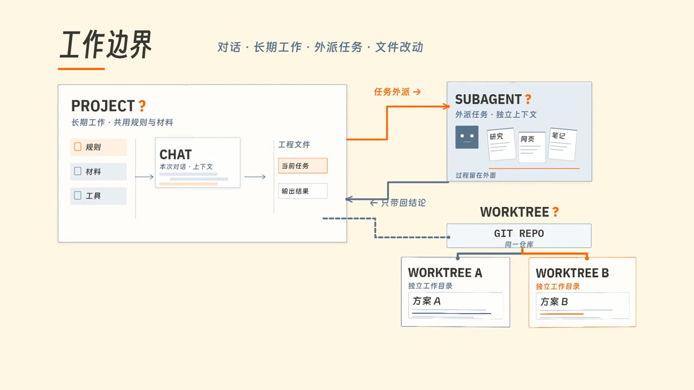
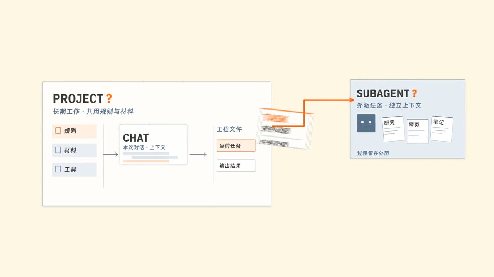
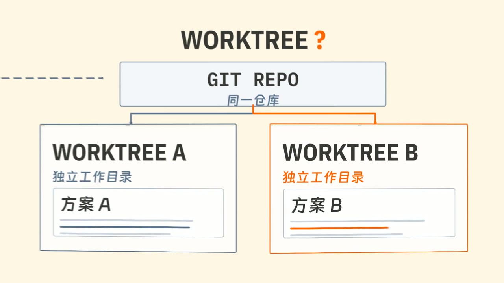

[抖音 · 一只桌子](https://v.douyin.com/7jbgafVeA4U/) · [YouTube · 一只桌子](https://www.youtube.com/@%E4%B8%80%E5%8F%AA%E6%A1%8C%E5%AD%90) · [小红书 · 一只桌桌桌子](https://xhslink.cn/o/2iZQ3Yc2j4E) · [bilibili · 一只桌子_table](https://b23.tv/7Y34qaP) · [X · 一只Table](https://x.com/YizhiTable)

**简体中文** · [English](README.en.md)

# Table-Video SOP

**AI 视频制作的 SOP、规则、经验、模板与提示词。**

把确认好的文案和配音，逐步做成有画面增量、可分段协作、能继续修改的视频。这套资料来自我的实际制作与返工，适合科普、观点讲解、产品演示等以配音为基准的视频。

你负责内容、风格与采用决定；Agent 负责规划、任务准备、动画与后期、检查和记录。生图、生视频由你在选定工具中手动完成。

> **可选模块**：我的文案、配音与声音设计仍在持续学习和优化。文案检查、音效与配乐制作方法供参考，可以选用或替换；不影响主制作流程的使用。

## 跟着做：从初始化到交付

先把完整资料包放入自己的系列目录，用能读写本地文件的 Agent 打开该目录。已有项目将资料包放入独立参考目录，先做接入映射，保留原有文件。**第一次对话作为总控**，负责整期规划、采用记录和总装；后续分段对话只负责各自任务。

下面的提示词可以直接复制，**替换方括号内的信息**，没有的填“无”或“待定”。**每次只发送当前一步**，检查结果后再发确认指令。新对话都从系列根目录开始；宿主未自动加载规则时，补一句“读取根目录 AGENTS.md，再处理下面的任务”。

**步骤跳转：** [1 环境](#step-1) · [2 DESIGN](#step-2) · [3 稿件与配音](#step-3) · [4 大段表](#step-4) · [5 分段设计](#step-5) · [6 视觉确认与制作](#step-6) · [7 总装](#step-7) · [8 声音与交付](#step-8) · [9 封面与发布](#step-9)

---

<a name="step-1"></a>

### 1. 初始化项目，检查工具是否可用

**用途：** 建立本期资料入口，确认工具、版本和缺失项。默认路线是 Remotion＋FFmpeg，也可以填写自己的路线。

```text
读取 AGENTS.md、docs/01_快速开始.md、docs/03_目录与并行协作.md 和 docs/07_工具与环境.md。
任务：[新建系列／接入已有项目]；系列名：[名称]；本期主题：[主题]。
平台与画幅：[填写]；制作路线：[Remotion＋FFmpeg／其他]；协作：[并行／串行]。
已有稿件、配音、参考和素材：[实际路径；没有写无]。
先检查实际路径、工具、版本与权限，不安装东西。
新项目按目录模板建立本期必要目录和本期说明；已有项目先列接入映射与冲突，等我确认后接入。
缺少信息标待补，缺少依赖列明安装方案、影响、验证方式和命令；不要把 DESIGN 写成已确认。
交付本期说明路径、环境检查结果和下一步。
```

**检查结果：** 本期目录能找到，工具可用性有实际证据。需要安装时，确认具体方案后再让 Agent 执行并验证预览、渲染与解码。

[环境说明](docs/07_工具与环境.md)

---

<a name="step-2"></a>

### 2. 确认静态与动态风格，建立 DESIGN.md

**用途：** 把“喜欢什么样子、怎样运动”变成可执行规范。已有确认过且适用的 `DESIGN.md` 可以复用；缺项只补测对应部分。

| 设计与影像参考 |
| :--- |
| 可以从这些网站寻找**配色、字体、构图与运动节奏**参考，选好后把作品链接或截图交给 Agent，并说明想借鉴的部分。<br><br>[Behance](https://www.behance.net/) · [Vimeo](https://vimeo.com/) · [Dribbble](https://dribbble.com/) · [站酷 ZCOOL](https://www.zcool.com.cn/) · [Pinterest](https://www.pinterest.com/) · [花瓣网](https://huaban.com/) |

**① 静态候选：先确认外观**

```text
读取 AGENTS.md、templates/DESIGN.template.md 和 docs/09_DESIGN建立与校验.md。
内容与受众：[填写]；画幅与观看场景：[填写]。
喜欢／不喜欢的视觉特点：[填写]；参考图：[路径及各自负责的画风、构图等]。
角色参考：[路径／不使用角色]。
做少量有明确差异、接近最终外观的真实设计图，比较配色、字体、布局、图形和角色；不要只交占位线框。
保存到 00_系列测试/静态/，保留可编辑源和参数，列出需要我选择的差异。先交候选，不视为确认。
需要 AI 生图时准备完整提示词和参考分工，由我手动生成。
```

**② 动态测试：确认运动方式**

```text
我采用的静态候选及范围：[准确路径、版本、采用哪些方面]。
读取 AGENTS.md、experience/视觉叙事与连续MG.md 和 experience/镜头推进与转场.md。
运动偏好：[克制／活泼／具体参考]。
沿用已确认外观，测试适用的形态变化、对象交互、跟随与停稳；运镜结合内容与情绪选择，不凑技法数量。
交实际可播放预览及源码、参数到 00_系列测试/动态/，说明差异，等我选定动态方案。
```

**③ 两项确认后，生成规范**

```text
确认静态样本：[路径、版本、范围]；确认动态样本：[路径、版本、范围]。
按 templates/DESIGN.template.md 与 docs/09_DESIGN建立与校验.md 整理根目录 DESIGN.md。
从采用样本提取配色、字体、布局、组件和运动参数，区分固定项、可变项与例外，并关联样本证据。
未测试或未确认的部分写待定；已有文件先保留回退版本，不覆盖无关内容。
```

**检查结果：** `DESIGN.md` 能定位采用样本，参数可执行；静态确认没有代替动态确认。

[详细模板](templates/DESIGN.template.md) · [填写示例](examples/03_DESIGN填写示例.md)

---

<a name="step-3"></a>

### 3. 准备确认稿件与配音

**用途：** 确定“讲什么”和制作所用的真实时基。把稿件放入本期 `01_稿件/`，配音放入 `02_配音/`。

**文案检查（可选）**：需要建议时发送；已有确认稿可跳过。

```text
本次选用文案检查。读取 AGENTS.md、docs/05_文案检查_可选.md 和 prompts/03_文案检查_可选.md。
稿件：[路径]；受众：[填写]；必须保留的事实、观点和个人语气：[填写]。
保持原稿不动，按该 SOP 完整检查，包含划走风险、五项建议与五病根；结合篇幅处理适用项。
只交一份审稿建议到本期 01_稿件/，标明原文位置、优先级、问题与改法，不直接重写全文。
```

**采纳建议时发送：**“采纳建议编号 `[编号]`，保留 `[内容]`；只改这些项，另存候选稿，等我确认。”

**确认稿件与配音：** 自己确认定稿并准备配音后，在总控发送：

```text
本期：[路径]；我确认的定稿：[准确路径、版本]；采用配音：[准确路径、版本]。
已有字幕与术语表：[路径／无]；交付平台、画幅和规格：[填写]。
读取 AGENTS.md，核对完整语义范围、顺序、停顿与稿件一致性，检查配音文件是否可用。
校对已有字幕，或在工具可用且获准时生成派生字幕；核对专有名词和实际声音时间，不能拿字幕区间当逐词起音。
将采用输入记录到本期说明；已有制作大段表时统一维护到该表。
有冲突或缺项先列清；缺少配音只做语义规划，不猜正式时间码，不开始依赖时基的动画。
```

**检查结果：** 采用文件与内容范围明确，配音和稿件相符；“有音频文件”不等于时基已核对。

[审稿方法](docs/05_文案检查_可选.md)

---

<a name="step-4"></a>

### 4. 出制作大段表，确认划段与路线

**用途：** 先确定每段新增什么画面信息、用什么做、哪里容易返工。

```text
读取 AGENTS.md、docs/02_制作SOP.md、docs/04_验收与返修.md 和 templates/制作大段表.template.md。
本期：[路径]；采用输入：[引用已核对的本期说明，或列准确定稿、配音、字幕路径与版本]。
DESIGN：[确认范围]；现有素材与真实证据：[路径／无]；补充要求：[填写]。
按叙事任务、视觉关系、技术路线或风险变化划段，不按固定秒数或一句一镜拆分。
逐段写声音已提供、画面新增、必要上屏文字、关键状态和衔接；正式时间必须核对实际配音。
交制作大段表到 00_本期控制/，附重点审查和生视频推荐两张短表，写清疑点、影响、验证、依赖与替代路线。
在聊天主动指出优先审查项和推荐理由；推荐不自动视为采用，先等我确认划段、路线与分工。
```

**确认大段方案：** 看过表与审查项后，在总控发送：

```text
确认制作大段表：[准确版本] 的划段、路线与分工。
生视频推荐采用：[段落 ID／不采用]；协作方式：[并行／串行]。
按 docs/03_目录与并行协作.md 自动准备所需目录和任务书，只补缺项，保留已有成果。
并行时生成 00_本期控制/分段开工指令.md，逐段填好真实绝对路径、采用输入、允许阶段、写入范围与接入说明位置。
检查输入存在、写入不重叠、转场有人负责；当前允许设计与素材准备，视觉方案仍待确认。
```

**检查结果：** 每段有负责人、输入、设计交付和依赖；并行开工指令已填完，可直接复制。

[两段规划示例](examples/01_两段演示.md)

---

<a name="step-5"></a>

### 5. 开新对话，完成分段设计与素材准备

**用途：** 各段独立设计，保留统一风格与总控记录。

从**同一个系列根目录**开新对话，逐段复制 `分段开工指令.md` 里的完整指令。每个对话只做一个分段；串行则在当前任务逐段推进。按任务书交真实干净设计图和独立运动标注，写入指定接入说明；总控文件由总控维护。

#### 生图与生视频

为每张参考图**分配职责**，锁定角色与画风，写清场景、动作、镜头和声音要求。你**手动生成并选片**，Agent 收片检查，再按实际画面校准动作与音效。

| 示例 1 | 示例 2 |
| :---: | :---: |
|  |  |

[生成经验](experience/手动生图生视频.md) · [提示词准备与收片](prompts/06_生图生视频.md)

**需要生图／生视频的段落**，在对应分段对话发：

```text
读取 AGENTS.md、DESIGN.md、experience/手动生图生视频.md 和本段任务书。
本段：[ID／任务书路径]；已采用的生成候选：[内容]。
生成工具与可用输入方式：[填写；不确定时核对官方说明]。
参考图及职责：[路径、角色／画风／构图]；必须准确的文字与声音要求：[填写]。
结合配音范围，交可直接粘贴进工具的完整生图、生视频提示词，以及参考上传顺序、参数、动作和声音要求、验收点。
以镜头起点 00:00.000 标动作计划；缺少实际配音时不猜正式时长。
提示词和参考清单放本段专属目录，由我手动生成，不代提交或重抽。
```

**收片检查：** 自己生成后，将文件交回同一分段对话：

```text
本段返回候选：[文件路径]。按任务书核对身份、语义、文字、画风、动作、运镜和声音。
列出可用范围和具体问题，区分需重做的生成部分与可后期处理的问题，保留可用部分。
如需重生成，给我完整修订提示词；先做收片检查，不擅自登记为采用。
```

**检查结果：** 设计图能看到实际外观；运动标注能说明注意力如何转移、何时变化和停稳。MG 与录屏路线同样按任务书交设计与检查依据，无需为了走流程去生视频。

[生成提示词示例](examples/02_生图生视频提示词示例.md) · [录屏经验](experience/录屏剪辑.md)

---

<a name="step-6"></a>

### 6. 确认全片视觉，再开始分段制作

**用途：** 在正式制作前统一检查各段风格、信息表达与衔接。

#### MG 动画与运镜

先判断**配音、场景和情绪**需要观众关注什么，再选择对象动作与镜头方式。**对比、传递、循环交接和空间揭示**都应给出具体方案；必要阅读窗口保持稳定。运动标注写清触发、落点、接触、状态变化及停稳。

| 局部聚焦：看清当前问题 | 拉远总览：揭示完整关系 |
| :---: | :---: |
|  |  |

| 对象传递：任务跨越边界 | 视角推进：进入工作区 |
| :---: | :---: |
|  |  |

[视觉叙事与连续 MG](experience/视觉叙事与连续MG.md) · [镜头推进与转场](experience/镜头推进与转场.md) · [动作与声音标记](templates/动作与声音标记.template.md)

*本页截图来自我第 4 期视频，用于展示视觉表达；它们不是本分享包的独立复现结果，静态截帧也不能展示完整运动效果。[截图来源](assets/README.md)*

**① 回到总控，汇总全片视觉**

```text
本期：[路径]；各段设计、运动标注和素材候选：[准确接入说明路径与版本]。
按 AGENTS.md 与当前制作大段表汇总全片视觉总览，不替我采用尚未确认的候选。
检查画面是否提供配音之外的信息，运镜是否符合配音、场景与情绪，阅读窗口和前后衔接是否成立。
交具体待确认项；未展示或未验证的动态效果单列，静态图不能算动态验证。
```

**② 确认视觉后，开放制作阶段**

选定后在总控发送：“确认视觉总览 `[版本、范围]`，采用素材 `[准确路径与版本]`；更新大段表和受影响任务书，允许 `[段落]` 进入制作。”

**③ 回到各分段对话，继续制作**

```text
总控已记录本段视觉确认：[表版本、确认范围]。核对更新后的任务书，继续获准制作。
有未解决且返工代价高的风险，先用覆盖真正难点的代表样片验证；已确认且条件未变的部分直接继续。
使用总控登记的工程环境，只写本段专属目录，不另装依赖或改公共组件。
按实际采用画面校准动作和声音标记；变速、裁切或时长变化后重新校准。
交可编辑源码、参数、预览和接入说明，写清素材版本、首尾状态、时间范围、声音策略、检查结果与未解决项。
```

**检查结果：** 各段交付可定位、可继续修改；候选与已采用版本分清。重渲染由总控协调。

[分段任务与边界](docs/03_目录与并行协作.md)

---

<a name="step-7"></a>

### 7. 总装并确认全片画面

**用途：** 把选定分段接入同一正式工程，检查跨段连续性。

```text
读取 AGENTS.md、docs/04_验收与返修.md 与本期制作大段表。
本期：[路径]；我决定采用的分段成果：[准确接入说明与版本]。
核对源码、参数、素材、首尾状态、时基、原声策略与检查证据，接入登记的唯一主工程或总装入口。
只采用我选定的版本；生成全片审片文件，检查语义、可读性、段间衔接、转场、遮挡、空帧与画幅。
分别更新制作大段表的采用状态和 QA 表的实际结论；无法审看的项目写未验证。
交审片文件与待决定问题，等我确认锁画范围。
```

**确认锁画：** 实际看完并接受画面后发送：“确认 `[审片版本与范围]` 锁画，进入声音、字幕与最终验收。”锁画就是确认当前画面版本；后续改画面要同步复查受影响的声音与字幕。[验收与返修](docs/04_验收与返修.md)

---

<a name="step-8"></a>

### 8. 处理声音与字幕，验收并交付

**音效与配乐（可选）**：选用时发送下面提示词；不选则直接进入最终合成。声音方案可以提前规划，正式对点以实际采用画面为准。

```text
本次选用声音制作，读取 AGENTS.md、docs/06_音效与配乐_可选.md 和 prompts/07_音效与配乐_可选.md。
本期与已锁画版本：[路径、版本]；采用配音：[路径]；现有声音方案：[路径／无]。
范围：[音效／配乐／两者]；原声策略：[保留／静音／混合及范围]。
已有可用素材与来源：[路径／无]；配乐方向：[填写／不使用]。
按实际动作、状态变化和情绪安排声音与安静窗口，不给每个动作机械配声。
单次音效写精确局部秒点，持续声音写起止区间；保留独立轨、音量包络、来源和混音参数，避免原声重复。
需要付费或素材授权不明时先列缺项；区分技术检查与实际审听，做不到的写未验证。
```

**字幕与最终验收：** 声音取舍确定后，在总控发送：

```text
画面已确认：[准确版本与范围]。
声音采用：[已确认音效／配乐的路径与版本，或仅采用既有配音和指定原声]。
字幕与交付规格：[填写或引用本期说明]。
按 docs/04_验收与返修.md、experience/字幕与封面.md 完成字幕、最终合成和验收。
核对定稿、配音、字幕和实际画面时间；检查声音去重、清晰度、遮挡、规格、完整解码、来源与隐私。
对最终文件做 1× 全片审看、审听；做不到的如实标未验证，不用测量或抽帧代替。
交付成片、适用的 clean 母版、字幕、可编辑工程与参数、复现说明及 QA 状态，列出剩余问题，不自动发布。
```

**检查结果：** 能找到成片和可复现源文件；检查过什么、没检查什么写清楚。跳过可选声音制作，仍要检查实际采用的配音、原声和字幕。

[声音方法](docs/06_音效与配乐_可选.md)

---

<a name="step-9"></a>

### 9. 准备封面与发布材料

**用途：** 让标题、封面和简介准确对应成片。需要发布时再做。

```text
按 experience/字幕与封面.md 准备封面和发布材料。
实际成片与主题：[路径／主题]；发布平台与用途：[填写]。
画风参考：[路径及职责]；构图参考：[路径及职责]；角色参考：[路径／不使用]。
希望保留的标题信息：[填写]。
核对当前平台所需画幅与官方规格，先给主题准确、文字可读的方案，等我确认方向。
```

**确认封面方向后发送：**

```text
采用封面方向：[具体方案]。准备完整生图提示词、参考上传分工、准确标题文字和后期说明，交我手动生图。
收回候选后检查并完成获准后期，整理标题、简介、必要署名和实际公开链接。
对完整发布材料核查事实、隐私、来源和承诺一致性；列待确认项，不自动对外发布。
```

**检查结果：** 发布材料齐全且与成片相符；实际上传由你操作，或明确指定平台、材料与权限后再交给 Agent。

[封面与发布检查](experience/字幕与封面.md)

<details>
<summary>完成后复盘（可选）</summary>

```text
按 prompts/09_复盘.md，基于本期制作大段表、接入说明、QA 和修改记录做精简复盘。
范围：[本期路径／返工段]。
只记录真实返工、反复漏做的事项和有证据支持的有效解法，写清触发、边界与证据。
通用方法、系列偏好和本期特例分开，未验证想法列候选。
先给建议修改的文件与简短改法，不自动改规则或发布。
```

</details>

---

## 分工与使用范围

`AGENTS.md` 负责任务路由，SOP 负责制作顺序，`DESIGN.md` 负责外观和运动，制作大段表记录本期采用版本与进度，QA 表记录实际检查结论。并行任务只写自己的专属目录，总控负责中央状态与总装。

资料包包含正文、模板、提示词、文字示例及 README 展示图片；不包含 demo、制作工程、生成服务或角色素材包。默认介绍 Remotion 与 FFmpeg 路线，也可以在保持相同输入、确认和验收要求的前提下使用其他工具。安装、登录、额外费用与发布需按任务范围取得授权。

模板与提示词中的方括号需要填写；正式分段指令由总控补齐实际路径。无需我的私人知识库、账号或旧项目，使用者也不应将自己的成片、账户资料和私人文件提交到这个资料仓库。

## 验证与许可状态

已在 Windows 与 Codex 环境中，通过不继承原对话的任务检查过主要路由并据结果修订。最新镜头选择规则只做了情境逻辑与文档交叉检查，尚未进行新的独立自然触发复测或实片验证。全新电脑安装、完整视听成片及视觉质量的独立复现仍未验证。

当前为私有整理版，尚未公开发布；正式许可证待确定。[来源与许可](docs/08_来源与许可.md)

## 联系我

欢迎交流实际制作中的问题与改进建议。

| 渠道 | 联系方式 |
| --- | --- |
| 邮箱 | [duoduoler@gmail.com](mailto:duoduoler@gmail.com) |
| X | [一只Table · @YizhiTable](https://x.com/YizhiTable) |
